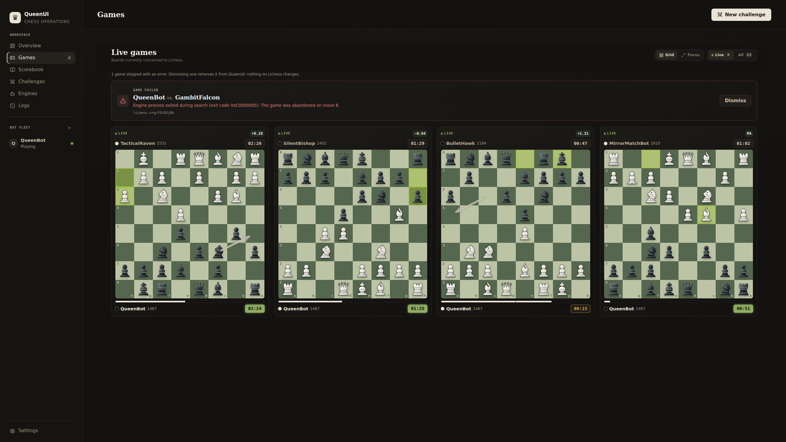
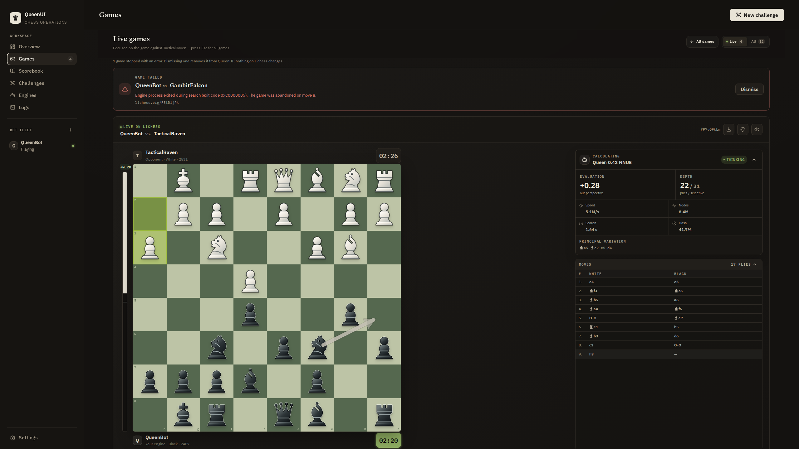

# QueenUI

QueenUI is a desktop app for running chess bots on Lichess. You add your UCI
engines and your Lichess `BOT` accounts, and QueenUI does the rest: it finds
opponents, plays the games, and shows you every board while it happens.



## What it does

- Runs several bot accounts at once. Accounts are isolated from each other,
  so a crashing engine or a dropped connection on one bot doesn't touch the
  others.
- Matchmaking: pick a rating range, clocks, rated or casual, and how many
  games to play in parallel. Stopping matchmaking lets running games finish.
- Shows all games in a grid, or one game up close with the engine's output.
  Frozen or failed games are labelled as exactly that.
- Can run the engines on a different machine. A small runner service keeps
  playing even when the desktop app is closed, and you can switch between
  local and remote without restarting anything.
- Survives crashes. After a restart it first checks with Lichess what is
  actually going on, then picks interrupted games back up.

## What it doesn't do

Pretty much everything else, on purpose:

- No local engine-vs-engine games, tournaments, or gauntlets. Use
  [Cutechess](https://github.com/cutechess/cutechess) or
  [fastchess](https://github.com/Disservin/fastchess) for that.
- No analysis board, opening prep, or game database. Use
  [En Croissant](https://encroissant.org/),
  [Nibbler](https://github.com/rooklift/nibbler), or Lichess itself.
- No playing chess yourself. QueenUI only accepts accounts with the `BOT`
  title and will never move a piece for a human account.
- Lichess only, standard chess only.

## Getting started

1. Open **Engines** and add a UCI engine executable.
2. Connect a Lichess `BOT` account with an API token. The app tells you
   right away whether the token can play and use matchmaking.
3. Start the account, start matchmaking, watch.



To run the engines on another machine instead, see
[docs/runner.md](docs/runner.md) — pairing is a one-time code.

## Development

Install [`just`](https://just.systems/) and run `just` to see the project
commands (CI uses the same recipes):

```sh
just install   # dependencies
just dev       # run the app
just check     # lint, tests, build
```

## Documentation

- [Reference](docs/REFERENCE.md) — features, campaign behavior, packaging, architecture
- [Headless runners](docs/runner.md) and the [runner protocol](docs/runner-protocol.md)
- [Persistence](docs/persistence.md) and [logs](docs/logs.md)
- [Frontend architecture](docs/frontend-architecture.md)

License: [GPL-3.0-or-later](LICENSE). Third-party notices are in
[docs/THIRD-PARTY-NOTICES.md](docs/THIRD-PARTY-NOTICES.md).
